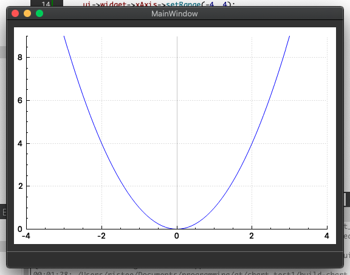

# How to create graphic in QT (MacOS)

1. Install XCode (Check actual version https://xcodereleases.com/)
2. Install QT (Try download for open source https://www.qt.io/download/). You need to sign up for download. You will use Online Installer. Choose "Design Tools", "Qt a.b for desktop development" (or other if you want) checkboxes.
3. Download https://www.qcustomplot.com/index.php/download
4. Try repeat guide https://www.youtube.com/watch?v=dlpNRDVHm8k. (If you will catch an error "undefined symbols for architecture x86_64" you should replay the video from the beginning, because you have missed one very important thing.)
5. ...
6. Profit.

Made with 